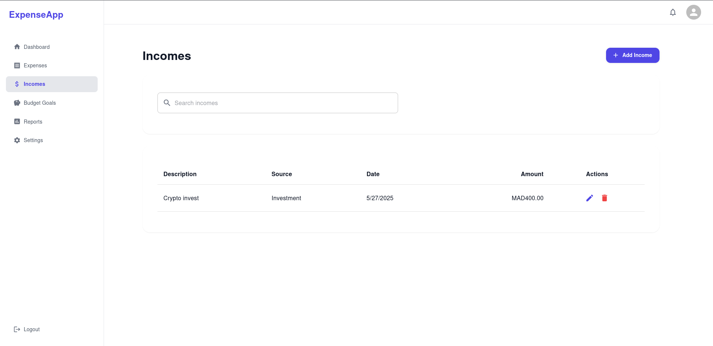

# Expense Web Application

A modern, full-stack web application for managing personal finances, built with React, TypeScript, and Node.js.

## 🌟 Features

### User Management
- Secure authentication with JWT
- User profile management
- Multi-currency support (MAD, USD, EUR)
- Two-factor authentication (2FA)
- Password reset functionality

### Financial Management
- Track expenses and incomes
- Set and monitor budget goals
- Generate financial reports and analytics
- Multi-currency transaction support
- Categorize transactions

### Dashboard & Analytics
- Interactive charts and graphs
- Financial overview
- Spending patterns analysis
- Budget progress tracking
- Custom date range filtering

### Security
- JWT-based authentication
- Password encryption
- 2FA support
- Secure session management
- Protected API endpoints

## 📸 Screenshots

### Dashboard

*Main dashboard with financial overview and key metrics*

### Expenses Management

*Track and manage your expenses with detailed categorization*

### Incomes Management

*Log and monitor your income sources with clear categorization and history tracking*

### Budget Goals

*Set and monitor your budget goals with progress tracking*

### Reports & Analytics

*Interactive charts and detailed financial reports*

### Profile & Settings


*User profile management and application settings*

## 🛠️ Tech Stack

### Frontend
- React 18
- TypeScript
- Material-UI (MUI)
- React Router v6
- Axios
- ApexCharts
- Formik & Yup
- Vite

### Backend
- Node.js
- Express.js
- MariaDB
- Sequelize ORM
- JWT Authentication
- Nodemailer
- Express Validator

## 🚀 Getting Started

### Prerequisites
- Node.js (v14 or higher)
- MariaDB
- npm or yarn

### Installation

1. Clone the repository:
```bash
git clone https://github.com/BadrEddineBakena/ExpenseWebApp.git
cd ExpenseWebApp
```

2. Install server dependencies:
```bash
cd server
npm install
```

3. Install client dependencies:
```bash
cd ../client
npm install
```

4. Configure environment variables:
   - Create `.env` file in the server directory
   - Add necessary environment variables (see `.env.example`)

5. Run database migrations:
```bash
cd ../server
npm run migrate
```

6. Start the development servers:

In the server directory:
```bash
npm start
```

In the client directory:
```bash
npm run dev
```

## 📁 Project Structure

```
ExpenseWebApp/
├── client/                 # Frontend React application
│   ├── src/
│   │   ├── assets/        # Static assets
│   │   ├── components/    # Reusable components
│   │   ├── contexts/      # React contexts
│   │   ├── layouts/       # Layout components
│   │   ├── pages/         # Page components
│   │   ├── services/      # API services
│   │   ├── theme/         # MUI theme configuration
│   │   └── utils/         # Utility functions
│   └── public/            # Public assets
│
└── server/                # Backend Node.js application
    ├── config/           # Configuration files
    ├── controllers/      # Route controllers
    ├── middlewares/      # Custom middlewares
    ├── models/          # Database models
    ├── routes/          # API routes
    └── utils/           # Utility functions
```

## 🔒 Security Features

- JWT-based authentication
- Password hashing with bcrypt
- Two-factor authentication
- Secure password reset flow
- Protected API endpoints
- Input validation
- CORS configuration

## 📊 API Documentation

The API documentation is available at `/api-docs` when running the server in development mode.

## 🤝 Contributing

1. Fork the repository
2. Create your feature branch (`git checkout -b feature/AmazingFeature`)
3. Commit your changes (`git commit -m 'Add some AmazingFeature'`)
4. Push to the branch (`git push origin feature/AmazingFeature`)
5. Open a Pull Request

## 📝 License

This project is licensed under the MIT License - see the [LICENSE](LICENSE) file for details.

## 👥 Author

Badr Eddine BAKENA

## 🙏 Acknowledgments

- Material-UI for the component library
- ApexCharts for the charting library
- All other open-source contributors